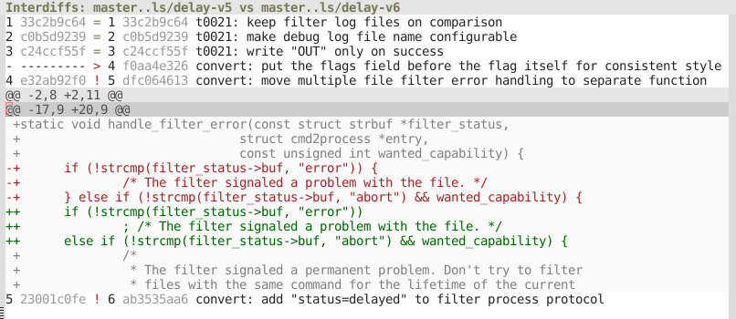

[![License GPL 3][badge-license]](https://www.gnu.org/licenses/gpl-3.0.txt)

Magit-tbdiff is a Magit interface to git-tbdiff, a Git extension for
comparing two versions of a topic branch.  See git-tbdiff's [homepage]
and its [announcement] on the Git mailing list for more information
about git-tbdiff.  The [commentary] in magit-tbdiff.el provides an
overview of Magit-tbdiff commands.

[badge-license]: https://img.shields.io/badge/license-GPL_3-green.svg
[commentary]: https://github.com/magit/magit-tbdiff/blob/master/magit-tbdiff.el#L24
[announcement]: https://public-inbox.org/git/87ip2pfs19.fsf@linux-k42r.v.cablecom.net/
[homepage]: https://github.com/trast/tbdiff
